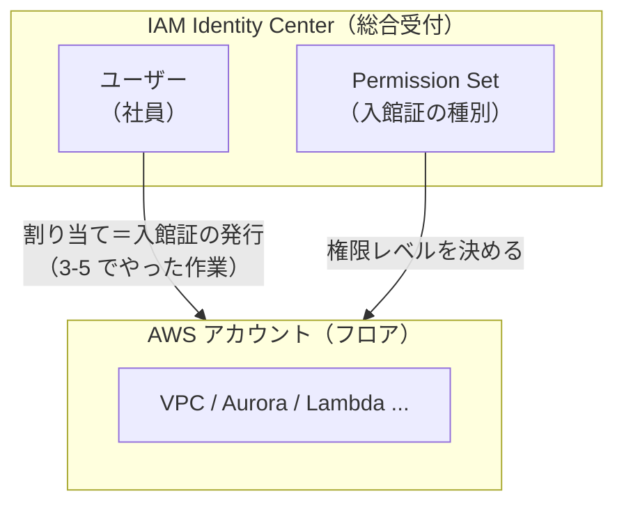

# AWS 事前準備ガイド（Lesson 7 用）

`docs/lessons/lesson-07-sst-deploy.html` を実施する前に、AWS 側で済ませておく操作・設定をまとめる。
このドキュメントは **AWSコンソールでの手動操作** が対象。`sst.config.ts` の中身（コードで書く部分）は Lesson 7 本文を参照。

---

## 1. AWSアカウントの準備

### 1-1. アカウントの用意

- 個人の検証用 AWSアカウントを推奨（会社アカウントは請求・権限の都合で避ける）
- 新規作成する場合は [aws.amazon.com](https://aws.amazon.com/) からサインアップする。手順の中で以下が求められる：
  1. ルートユーザーのメールアドレスとアカウント名
  2. メールアドレスの確認コード入力
  3. 支払い方法（クレジットカード）の登録
  4. **電話番号による本人確認**（SMS または音声通話で確認コードが届く）
  5. **サポートプランの選択 → 一番左の「Basic support - Free」を選ぶ**（有料プランを選ばないよう注意）
- **新規アカウントは有効化までに数分〜数時間かかることがある**。「アカウントを検証中」と表示される間はデプロイできないので、Lesson 7 を始める前日までにアカウント作成を済ませておくと安全。

### 1-2. ルートユーザーを日常操作に使わない

- サインアップ直後は**ルートユーザー**（アカウント作成時のメールアドレスでログインするユーザー）のみが存在する。ルートユーザーは何でもできてしまうため、**日常的な作業（CLI操作やデプロイ）には使わない**のがAWSのベストプラクティス。
- ルートユーザーは以下の初期設定のみに使い、以降は IAM Identity Center で作る作業ユーザー（セクション3）で操作する：
  - ルートユーザー自身の MFA 設定（1-3）
  - 請求関連の設定（セクション2）
  - IAM Identity Center の有効化と作業ユーザーの作成（セクション3）

### 1-3. ルートユーザーの MFA を設定する

MFA（多要素認証）は、パスワードに加えてスマホアプリの6桁コードなどを要求する仕組み。ルートユーザーは権限が強いため必ず設定する。

1. AWSコンソールにルートユーザーでサインイン
2. 画面右上のアカウント名をクリック → **Security credentials**（セキュリティ認証情報）を開く
3. **Multi-factor authentication (MFA)** セクションの **Assign MFA device** をクリック
4. **Device name** に任意の名前（例: `my-phone`）を入力
5. MFA タイプで **Authenticator app**（認証アプリ）を選択 → **Next**
6. スマホに認証アプリ（Google Authenticator、Microsoft Authenticator、Authy など）を入れておく
7. 画面の QR コードをアプリでスキャン
8. アプリに表示される6桁コードを、**連続する2回分**入力欄に入力（例: いま出ているコードと、30秒後に切り替わった次のコード）→ **Add MFA**
9. 「MFA device assigned」と表示されれば完了。次回以降ルートユーザーでログインする際にコードを求められる

---

## 2. 請求アラートの設定（先に必ずやる）

Aurora・NAT・CloudFront など従量課金リソースを作成するため、想定外の課金に気づけるようにしておく。

### 2-1. AWS Budgets でアラートを作成

> **閾値は「$0」ではなく「$5〜$10」にする。** このレッスンは Aurora のストレージ課金などで**確実に数ドル発生する**ため、Zero spend budget（$0超で通知）にすると初日から毎日アラートが飛んで意味をなさない。「想定外に膨らんだとき」に気づける閾値を置くのが目的。

1. AWSコンソール → 検索バーで **Billing and Cost Management** を開く
2. 左メニューの **Budgets** → **Create budget**
3. **Budget setup** で **Customize (advanced)** を選択
4. **Budget type** は **Cost budget** を選択 → **Next**
5. 以下を設定：
   - **Budget name**: 例 `lesson7-guardrail`
   - **Period**: `Monthly`（月次）
   - **Budgeted amount**: `10`（＝月 $10 を上限の目安にする。学習用途なら十分な余裕）
6. **Next** → **Add alert threshold** で通知の閾値を設定：
   - **Threshold**: `80` % of budgeted amount（＝$8 到達で通知）
   - **Email recipients**: 受信できるメールアドレスを入力
7. **Next** → 内容を確認して **Create budget**

> 実際の課金予想を厳しめに見張りたい場合は、閾値を複数（50% / 80% / 100%）追加してもよい。

### 2-2. Billing のリージョン集計を確認する習慣

- **Billing and Cost Management** → **Cost Explorer** で、サービス別の課金内訳を確認できる状態にしておく
- **注意: Cost Explorer は初回に有効化してからデータが反映されるまで最大 24 時間かかる。** 有効化直後はグラフが空でも異常ではない。Lesson 7 開始の前日までに一度開いて有効化しておくと、デプロイ後すぐ内訳を見られる
- Lesson 7 のチェックポイントに「AWS コンソールの Billing で課金状況を一度確認した」とある通り、初回デプロイ後に必ず見る

---

## 3. 作業ユーザーの準備（IAM Identity Center による SSO ログイン）

長期間有効なアクセスキーを持つ IAM ユーザーを作る代わりに、**IAM Identity Center**（旧 AWS SSO）でユーザーを作成し、CLI からブラウザ経由でログインする方式にする。
アクセスキーを `.aws/credentials` に平文で置かずに済み、セッションが自動的に失効するため、学習用途でも安全側に倒しやすい。

### 概念図

**たとえ話：オフィスビルの入館証システム**

| Identity Center の概念 | たとえ |
|---|---|
| IAM Identity Center | ビル1階の総合受付（全フロアの入館証を一括管理） |
| ユーザー | 社員（人そのもの） |
| Permission Set | 入館証の種別（マスターキー／一般キーなど） |
| AWS アカウント | 各フロア（実際に仕事をする場所） |
| 割り当て | 「この社員にこの種別の入館証を発行してこのフロアへ入れる」という手続き |

受付で社員登録しただけでは、どのフロアにも入れない。「発行（割り当て）」をして初めて入れるようになる。



**旧来の IAM ユーザーとの違い**

旧来の IAM ユーザーはフロアごとに独立した入館証システムがある状態。フロアが増えるたびに別々に登録が必要で、退職時も各フロアで個別に削除しなければならなかった。

Identity Center は「総合受付1箇所で全フロア分を管理」できるため、退職者の削除漏れのようなリスクを減らせる。今回は AWS アカウントが1つだけなので恩恵がわかりにくいが、複数アカウント構成（本番／開発など）で威力を発揮する仕組み。

### 3-1. IAM Identity Center の有効化

1. AWSコンソールにルートユーザー（または管理者権限を持つユーザー）でサインイン
2. **先にリージョンを設定する** — IAM Identity Center は「Enable を押した時点で選択されているリージョン」がホームリージョンになる。**画面右上のリージョン選択ドロップダウン**（例:「東京」「バージニア北部」などと表示されている箇所）をクリックし、使いたいリージョン（迷ったら **アジアパシフィック（東京）ap-northeast-1**）に切り替えておく
3. 画面上部の検索バーに **IAM Identity Center** と入力して開く
4. 初回アクセス時は **Enable** ボタンが表示されるのでクリック
5. **Choose your identity source** のようなダイアログが出た場合はデフォルト（Identity Center directory）のままで進める
6. まだ **AWS Organizations** を使っていないアカウントの場合、「Identity Center を有効化すると同時に Organization を作成します」という確認ダイアログが出る → **Create AWS organization** をクリックして進める（学習用の単一アカウントでも問題なく有効化できる）
7. 数十秒待つと **Enabled** ステータスになり、IAM Identity Center のダッシュボードが表示される

> **ホームリージョンは後から変更できない**（変えるには一度 Identity Center を無効化して作り直す必要がある）。手順2でのリージョン選択を忘れないこと。画面右上に表示されているリージョン名が意図どおりか、Enable を押す前に必ず確認する。

### 3-2. Identity source（ユーザーの管理元）の確認

1. 左メニュー **Settings** → **Identity source** タブを開く
2. デフォルトで **Identity Center directory**（組み込みのユーザーストア）になっていることを確認する。外部IdP（Okta、Azure ADなど）と連携することも可能だが、学習用途では組み込みのままでよい

### 3-3. ユーザーの作成

1. 左メニュー **Users** → **Add user**
2. 以下を入力する
   - **Username**: 例 `your-name`
   - **Email address**: 実際に受信できるメールアドレス（招待メールが届く）
   - **First name** / **Last name**
   - **Display name** は自動入力されたままでよい
3. パスワードは「招待メールから自分で設定する」を選択（デフォルト）
4. **Next** → グループへの追加画面が出るが、学習用の単一ユーザーなら何も選ばず **Next**
5. 内容確認画面で **Add user** をクリックして作成完了

### 3-4. Permission set（権限セット）の作成

Permission set は「このユーザーがAWSアカウント内で持てる権限の定義」。IAMポリシーのSSO版だと考えるとよい。

1. 左メニュー **Permission sets** → **Create permission set**
2. **Permission set type** で **Predefined permission set** を選択
3. 一覧から **AdministratorAccess** を選ぶ（学習用途はフルアクセスで進めるのが簡単。個別ポリシーを積み上げる方式は権限不足のデバッグが面倒になるため非推奨）
4. **Next**
5. **Permission set name** はデフォルト（`AdministratorAccess`）のままでよい
6. **Session duration** — デフォルトは1時間。作業中に何度も再ログインするのが煩わしければ `8 hours` などに延ばしておく
7. **Next** → 内容確認 → **Create**

### 3-5. ユーザーをAWSアカウントに割り当てる

1. 左メニュー **AWS accounts** タブを開く
2. 対象のAWSアカウント（今操作している自分のアカウント）にチェックを入れる
3. **Assign users or groups** をクリック
4. **Users** タブで 3-3 で作成したユーザーにチェック → **Next**
5. Permission sets の一覧から 3-4 で作成した **AdministratorAccess** にチェック → **Next**
6. 内容を確認し **Submit**
7. 数十秒〜数分待つと割り当てが反映される（画面上のステータスが `PROVISIONING SUCCEEDED` になれば完了）

### 3-6. 初回サインインとMFA登録

1. 3-3 で登録したメールアドレス宛に届く招待メール（件名例: "Invitation to join AWS IAM Identity Center"）を開く
2. メール内の **Accept invitation** リンクをクリック
3. 案内に従いパスワードを設定
4. MFAデバイスの登録を求められる。認証アプリ（Google Authenticator、Authy など）を推奨
   - 表示されたQRコードをアプリでスキャン
   - アプリに表示された6桁のコードを入力して登録完了
5. 登録が終わると **AWS access portal** のURL（例: `https://d-xxxxxxxxxx.awsapps.com/start`）にアクセスできるようになる。**このURLは次の手順で使うので必ず控えておく**

### 3-7. アクセスポータルURLの確認（後から見る場合）

1. IAM Identity Center のダッシュボードのトップページを開く
2. 画面上部または **Settings** の概要部分に **AWS access portal URL** が表示されている
3. これをコピーしておく

---

## 4. AWS CLI のセットアップ（SSO ログイン）

### 4-1. インストール確認

```bash
aws --version
```

未インストールの場合、macOS なら Homebrew で入れるのが簡単：

```bash
brew install awscli
```

Homebrew を使わない場合は [公式インストーラ](https://docs.aws.amazon.com/cli/latest/userguide/getting-started-install.html) の手順に従う。インストール後、`aws --version` の出力が **`aws-cli/2.x.x`** であることを確認する（SSO関連コマンドは CLI v2 が前提。`1.x` だと動かない）。

### 4-2. `aws configure sso` の実行

```bash
aws configure sso
```

対話式で以下を入力していく。

```
SSO session name (Recommended): braindump-todo
SSO start URL [None]: https://d-xxxxxxxxxx.awsapps.com/start   # 3-6 で控えたポータルURL
SSO region [None]: ap-northeast-1   # 3-1 で選んだ IAM Identity Center のホームリージョン
SSO registration scopes [sso:account:access]: （そのまま Enter でよい）
```

- 入力後、自動的にブラウザが開き、確認コードが表示される
- 3-6 で設定したユーザーでサインイン（既にログイン済みならスキップされることもある）
- 「Allow」を押して CLI からのアクセスを許可する

ブラウザでの許可が終わるとターミナルに戻り、割り当てられているアカウント・権限セットの選択を求められる。

```
There are 1 AWS accounts available to you.
> 123456789012 (アカウントのエイリアス)

There are 1 roles available to you.
> AdministratorAccess
```

続けてプロファイルの設定を聞かれる。

```
CLI default client Region [None]: ap-northeast-1
CLI default output format [None]: json
CLI profile name [123456789012_AdministratorAccess]: sst-deploy
```

**profile name は覚えやすい名前（例: `sst-deploy`）に変更しておくと、以降のコマンドが打ちやすい。**

### 4-3. ログイン

初回設定時に自動でログイン済みだが、セッションが切れた後の再ログインは以下で行う。

```bash
aws sso login --profile sst-deploy
```

ブラウザが開き「Allow」を押すと、ターミナルに `Successfully logged into Start URL` と表示される。

### 4-4. 疎通確認

```bash
aws sts get-caller-identity --profile sst-deploy
```

以下のように、自分のアカウント情報が返れば設定完了。

```json
{
    "UserId": "AROAxxxxxxxxxxxxx:your-name",
    "Account": "123456789012",
    "Arn": "arn:aws:sts::123456789012:assumed-role/AWSReservedSSO_AdministratorAccess_xxxxxxxxxxxxxxxx/your-name"
}
```

### 4-5. プロファイルの指定方法（default にはしない）

このガイドでは `default` プロファイルを作らず、**名前付きプロファイル `sst-deploy` を明示的に指定する**方針にする。認証情報を暗黙のデフォルトにせず、「どのプロファイルで操作しているか」を常に意識できるようにするため。

指定方法は2通り。**作業するターミナルごとに、そのセッションでだけ有効にする**のがおすすめ：

```bash
# このターミナルを開いている間だけ sst-deploy を使う（推奨）
export AWS_PROFILE=sst-deploy
```

または、1コマンドずつ先頭に付ける：

```bash
AWS_PROFILE=sst-deploy aws sts get-caller-identity
```

> **`.zshrc` などシェル設定ファイルへの永続追記はしない。** そこに書くと全ターミナルで常時このプロファイルが使われ、実質的に default と同じ挙動になってしまう。Lesson 7 の作業をするターミナルで、そのつど `export` するに留める。

### 4-6. セッション切れへの対処

IAM Identity Center のセッションは、3-4 で設定した Session duration（デフォルト1時間）を過ぎると失効する。以下のようなエラーが出たら再ログインすればよい。

```
Error loading SSO Token: Token for … does not exist
```
または
```
An error occurred (ExpiredTokenException) …
```

対処:

```bash
aws sso login --profile sst-deploy
```

---

## 5. リージョンの選定

### 5-1. Aurora Serverless v2 が使えるリージョンか確認

- 主要リージョン（`us-east-1`, `us-west-2`, `ap-northeast-1` など）であれば概ね対応している
- 迷ったら `ap-northeast-1`（東京）で問題ない。CloudFront はエッジ配信のためリージョン選択の影響を受けにくい

### 5-2. リージョンの反映先

- `aws configure sso` で設定した `CLI default client Region`（4-2 参照）が、`sst deploy` 実行時のデフォルトリージョンとして使われる
- `sst.config.ts` 側でリージョンを明示的に上書きすることも可能（Lesson 7 の設定例では未指定 = プロファイル設定に従う）
- **IAM Identity Center 自体のホームリージョン（3-1）** と **デプロイ先のリージョン（5-1・5-2）は別物**であることに注意。前者は「ログインの仕組みがどこにあるか」、後者は「VPCやAuroraが実際に作られる場所」を指す。同じリージョンにする必要はない

---

## 6. Lesson 7 のコマンドを実行するときの共通ルール

Lesson 7 本文には `pnpm dlx sst deploy --stage dev` のように **プロファイル指定のないコマンド**が並んでいる。このガイドは名前付きプロファイル `sst-deploy` を使うため、**そのままコピペしても認証情報が見つからず失敗する**。以下を必ず守ること。

### 6-1. すべての sst コマンドはプロファイルを効かせて実行する（最重要）

Lesson 7 の作業を始めるターミナルで、最初に一度だけ実行しておく：

```bash
export AWS_PROFILE=sst-deploy
```

これでそのターミナル内の `pnpm dlx sst deploy` / `sst tunnel` / `sst secret set` / `sst remove` すべてに `sst-deploy` プロファイルが効く。

- **別のターミナルタブを開いたら、そのタブでも改めて `export AWS_PROFILE=sst-deploy` を実行する**（export はターミナルごと）。Lesson 7 手順5では「deploy 用」と「tunnel 用」で複数タブを使うので、各タブで忘れずに設定する。
- export し忘れたまま `sst deploy` すると `The security token included in the request is invalid` や `Unable to locate credentials` のようなエラーになる。その場合は export してから再実行すればよい。

### 6-2. 作業前に SSO ログインが生きているか確認する

セッションは時間で切れる（4-6）。作業開始時に一度確認しておくと途中で止まらない：

```bash
aws sts get-caller-identity --profile sst-deploy
```

エラーが出たら `aws sso login --profile sst-deploy` で再ログインする。

### 6-3. `sst tunnel` の初回セットアップ（Lesson 7 手順5で必要）

Lesson 7 手順5（Aurora へのマイグレーション）で使う `pnpm dlx sst tunnel` は、**初回だけ専用のネットワークプログラムのインストールが必要**で、これに管理者権限（sudo）が要る。マイグレーション当日に慌てないよう、事前に済ませておく：

```bash
sudo pnpm dlx sst tunnel install
```

- macOS のパスワード（PC のログインパスワード）を求められる
- これは1回やれば以降は不要
- インストールせずに `sst tunnel` を実行すると「トンネル用のクライアントが見つからない」旨のエラーで止まる

> うまくいかなければ Lesson 7 手順5の直前に実行しても間に合う（所要1分程度）。

---

## 7. Lesson 7 実施前の最終チェックリスト

- [ ] AWSアカウントを作成し、有効化（検証中でない状態）まで完了した
- [ ] ルートユーザーに MFA を設定した（1-3）
- [ ] 請求アラート（Budgets）を $10 目安で設定した
- [ ] Cost Explorer を有効化した（データ反映まで最大24時間かかる点を把握）
- [ ] IAM Identity Center を有効化した（ホームリージョンを意図どおりに選んだ）
- [ ] IAM Identity Center にユーザーを作成し、`AdministratorAccess` の Permission set をアカウントに割り当てた
- [ ] 招待メールからパスワード設定・MFA登録を済ませた
- [ ] AWS CLI v2 をインストールした（`aws --version` が `aws-cli/2.x`）
- [ ] `aws configure sso` でプロファイル `sst-deploy` を設定した
- [ ] `aws sso login --profile sst-deploy` でログインできる
- [ ] `aws sts get-caller-identity --profile sst-deploy` が正しいアカウント情報を返す
- [ ] 作業ターミナルで `export AWS_PROFILE=sst-deploy` する運用を理解した（6-1）
- [ ] `sudo sst tunnel install` を済ませた、または当日実行すると把握している（6-3）
- [ ] Lesson 1〜6 がローカル（Docker Postgres）で動作している
- [ ] `.env` に `BETTER_AUTH_SECRET` が設定済み
- [ ] （任意）OpenAI APIキーを用意した。無ければ Lesson 7 時点ではダミー値で進めて良い（Lesson 8 で本番の値に差し替える）
- [ ] まとまった時間（目安 3 時間、初回デプロイ自体は 15〜30 分）を確保した

---

## 8. 片付け（Lesson 7 完了後・検証終了後）

作成したリソースは放置すると課金が続くため、検証が一区切りしたら削除する。

```bash
export AWS_PROFILE=sst-deploy
pnpm dlx sst remove --stage dev
```

- `sst.config.ts` の `removal` 設定により、`stage === "production"` 以外（今回は `dev`）は削除時に実データも一緒に消える（`remove` 設定）
- `sst remove` にも SSO ログインとプロファイルが必要。切れていたら `aws sso login --profile sst-deploy` を先に実行する

### 8-1. 本当に消えたかコンソールで目視確認する

`sst remove` の完了メッセージが出ても、稀に削除しきれないリソースが残ることがある（残ると課金が続く）。**デプロイしたリージョン**（画面右上のリージョンを合わせてから）で以下を確認する：

- **EC2** → **Instances** — NAT/Bastion 用のインスタンスが `terminated` になっているか（`running` が残っていないか）
- **RDS** → **Databases** — Aurora クラスタが消えているか
- **VPC** → **Your VPCs** — このアプリの VPC が消えているか
- **CloudFront** — ディストリビューションが消えているか

残っているものがあれば各コンソールから手動で削除する。最後に **Billing** で課金が止まっていることを確認する。

> **SST のブートストラップ用リソースは意図的に残る。** SST は初回に `sst-state-...` のような名前の S3 バケットや SSM パラメータを作り、これらは `sst remove` では消えない（次に SST を使うときの土台になるため）。ストレージ課金はごくわずか（ほぼ $0）。完全に AWS を使い終える場合のみ、S3 コンソールから手動で削除してよい。

### 8-2. IAM Identity Center の後片付け（任意）

IAM Identity Center 自体を使い終わったら、不要であれば後片付けする。

- ユーザーの割り当てだけ外す場合: **IAM Identity Center** → **AWS accounts** → 対象アカウント → 対象ユーザーを選択 → **Remove access**
- ユーザーごと削除する場合: **Users** → 対象ユーザー → **Delete user**
- IAM Identity Center 自体を無効化する場合: **Settings** → **Disable Identity Center**（学習が完全に終わった後の最終手段。再度有効化すると設定をやり直すことになる点に注意）

---

## 参考リンク

- [AWS CLI インストールガイド](https://docs.aws.amazon.com/cli/latest/userguide/getting-started-install.html)
- [SST — Next.js on AWS](https://sst.dev/docs/start/aws/nextjs/)
- [SST — Aurora コンポーネント](https://sst.dev/docs/component/aws/aurora/)
