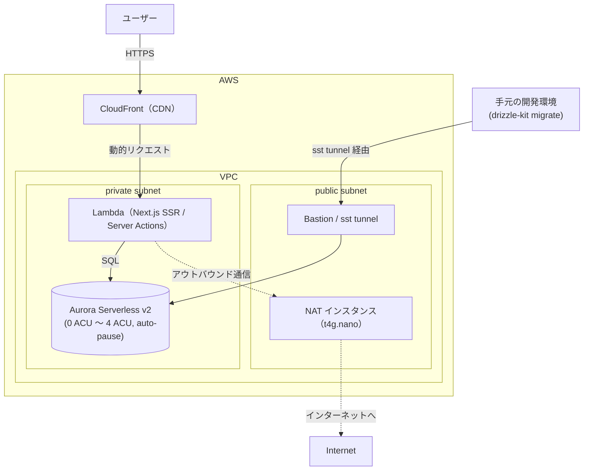

# 学習メモ

## Aurora Serverless v2 vs RDS（2026-07-22）

### なぜ RDS ではなく Aurora Serverless v2 なのか

- Aurora が高いのは**プロビジョンドクラスター（常時起動）**の話。最低でも月数千円〜かかる
- Serverless v2 は `scaling.min: "0 ACU"` + auto-pause で**非アクティブ時の計算コストがゼロ**になる
- ストレージ課金は継続するが月 $1〜数ドル程度。Neon・Supabase の無料枠と大差ないコスト感

### SST との相性が選定理由の核心

- `sst.aws.Aurora` コンポーネントが VPC・セキュリティグループ・クラスターをまとめて数行で構築できる
- Lambda / CloudFront との `link` も自動で通る

### PostgreSQL 互換でローカルと差し替え容易

- ローカル：Docker PostgreSQL / 本番：Aurora Serverless v2
- `DATABASE_URL` を差し替えるだけで同じ Drizzle コードが動く

### RDS が向いているケース

- 常時高負荷なサービス → コスト予測が安定する
- コールドスタート（auto-pause からの復帰で数秒）が許容できない本番サービス → auto-pause をオフにするか RDS を選ぶ

## サービス層とは（Day 14）

「ビジネスの判断を、HTTP の都合から切り離して独立させた層」。

### 典型的な3層構造

```
プレゼンテーション層  ← Next.js Route Handler / Server Action（HTTP を扱う）
サービス層           ← service.ts（所有者チェックなどビジネスロジック）
データ層             ← Drizzle ORM（SQL 発行）
```

### なぜ分けるのか

Route Handler にロジックを直書きすると：

- **テストしづらい** — HTTP リクエストを作らないとテストできない
- **再利用できない** — WebSocket や cron job から同じロジックを呼べない
- **next/* に依存** — Next.js を替えたら全部書き直し

### サービス層のルール

- `next/*` を一切 import しない
- 引数で `db`・`userId`・対象 id を受け取る
- 所有者チェック（`todo.userId !== userId`）はここに置く

### `next/*` に依存しないとは

`revalidatePath()` や `redirect()` など Next.js 固有の関数をサービス層に書かない、ということ。

```ts
// Server Action（next/* を使う側）
async function deleteTodoAction(id: string) {
  await deleteTodo(db, userId, id)  // サービス層に委譲
  revalidatePath("/todos")          // next/* はここに残す
}

// service.ts（next/* を import しない）
export async function deleteTodo(db, userId, id) {
  // DB操作と所有者チェックだけ
}
```

サービス層が `revalidatePath` を知っていると Next.js なしでは動かない関数になるため分離する。

## Lesson 7 の前提インフラ知識（2026-07-24）

### AWS の基本構成要素

| リソース | 役割 |
|---|---|
| **VPC**（Virtual Private Cloud） | AWS上の仮想ネットワーク。Aurora はこの中に隔離され、インターネットから直接は届かない |
| **サブネット** | VPC内をさらに区切った単位。public（インターネット直結）と private（NAT経由）がある |
| **NAT**（NAT Gateway / NAT Instance） | private サブネット内のリソースが「外に出ていく」ための出口。逆に外から中には入れない |
| **Lambda** | Next.js のサーバー部分（SSR、Server Actions）が実行される場所。リクエストごとに起動するサーバーレス関数 |
| **CloudFront** | CDN。ユーザーからのリクエストを受け、静的アセットはキャッシュから、動的処理は Lambda に転送する |
| **Aurora Serverless v2** | PostgreSQL 互換のマネージドDB。ACU（Aurora Capacity Unit）単位でスケールし、0 ACU まで落として自動停止（auto-pause）できる |
| **Bastion**（踏み台） | VPC 内リソースへ手元から接続するための中継点。今回は `sst tunnel` がこれを代替 |

### ネットワーク構成図



### なぜ VPC の中にDBを置くのか

Lambda はデフォルトでは VPC の外（AWSのマネージド環境）で動くが、Aurora のような RDS 系DBは通常 VPC 内に隔離される。そのため Lambda 側にも `vpc` を指定してVPC内に参加させないと、DBに到達できない（「つまずきポイント」の典型例）。

### IaC（Infrastructure as Code）と Pulumi

SST v3 は内部的に **Pulumi** というIaCエンジンの上に構築されている。Terraform と似た「宣言的にインフラを記述→差分をapply」という思想だが、Pulumi は TypeScript のようなプログラミング言語でインフラを書けるのが特徴。`sst.config.ts` の中身がそれで、`new sst.aws.Aurora(...)` のようなコードがそのままAWSリソースの生成・更新・削除の単位になる。

「デプロイ失敗しても再実行すれば途中から続きをやってくれる（冪等）」という記述は、この Pulumi の状態管理（state）による。

### コスト構造の考え方

「動いているかどうか」と「課金されるかどうか」が一致しないリソース（Aurora の auto-pause、ストレージ課金）があることを理解しておくと、後の「コールドスタート観測」の意味が腑に落ちやすい。

### Better Auth と CloudFront URL の関係

認証系は「自分がどのURLで動いているか」を知る必要があるため（Cookie の domain / secure 属性、リダイレクト先など）、デプロイ後に判明する CloudFront の URL を環境変数として渡し直す、という2段階デプロイの流れになっている。

### CloudFront の役目（動的／静的の振り分け）

`sst.aws.Nextjs` は内部的に **OpenNext** を使い、Next.js アプリを次のように分解している。CloudFront はこの「どのパスをどこに投げるか」を振り分ける入口。

```
CloudFront（入口・振り分け）
  ├─ 静的アセット（_next/static, 画像など）→ S3 から直接配信
  ├─ 画像最適化（next/image）→ 専用の Lambda
  └─ SSR / Server Actions / API Route → メインの Lambda
```

CloudFront がない場合に失われるもの：

- **振り分け先の一元化** — 静的アセットもすべて Lambda にリクエストが飛び、画像1枚読むだけで Lambda が起動する（コールドスタート・課金の悪化）
- **キャッシュ** — CDNのエッジキャッシュがないと、同じファイルへのリクエストのたびに S3 / Lambda まで往復する
- **URLの一本化** — Lambda用URL（Function URL / API Gateway）と S3用URLが別ドメインになり、`BETTER_AUTH_URL` のような「自分自身のURLを知る」設定が複雑になる（Cookie の domain / secure 属性が絡む）
- **HTTPS・カスタムドメインの一元管理** — CloudFrontはACM証明書と紐づけて独自ドメインでHTTPS配信する窓口も兼ねている

まとめると、CloudFrontを抜くと「静的配信・動的処理・キャッシュ・HTTPS・単一URL」を自前で組み合わせる必要が出る。
